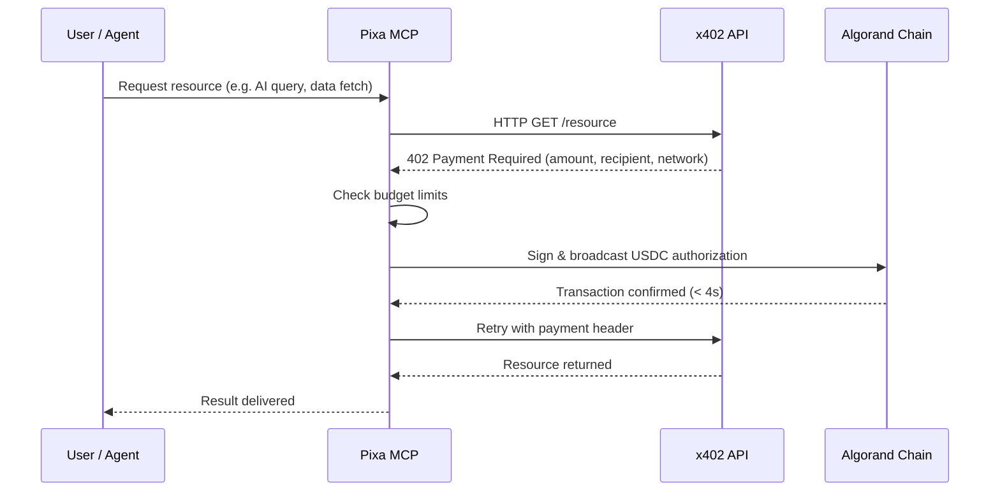
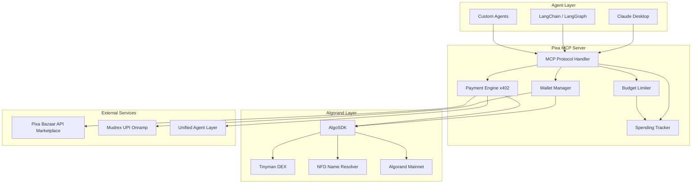
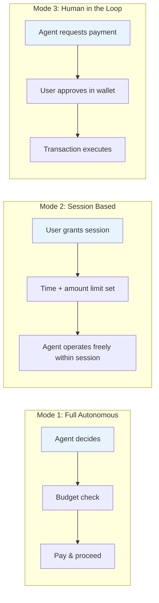
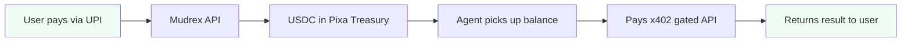

# Pixa Wallet

> The first agentic payment wallet built for Algorand — plug into Claude or any agent framework in under 60 seconds.


---

AI agents can reason. They can plan. They can execute.

But they cannot pay — until now.

Pixa is a full-featured MCP wallet that gives AI agents the ability to autonomously discover, authorize, and settle micropayments on Algorand using the x402 protocol. No API keys. No pre-configured billing. No human in the loop unless you want one.


---

## How It Works



---

## Architecture



---

## Autonomy Modes



---

## Payment Flow — UPI to Agent



---

## Installation

### Non-Technical Users — One Click

Download the `.mcpb` extension and double-click. Pixa installs automatically into Claude Desktop. No terminal. No configuration files.

**[Download Latest Release →](https://github.com/soumyacodes007/Pixa/releases/latest)**

---

### Developers — JSON Config

Add to your Claude Desktop config file:

**macOS:** `~/Library/Application Support/Claude/claude_desktop_config.json`  
**Windows:** `%APPDATA%\Claude\claude_desktop_config.json`

```json
{
  "mcpServers": {
    "pixa": {
      "command": "npx",
      "args": ["-y", "pixa-wallet-mcp"],
      "env": {
        "ALGORAND_MNEMONIC": "your 25-word mnemonic here",
        "NETWORK": "algorand-mainnet",
        "MAX_PER_CALL": "0.10",
        "MAX_PER_DAY": "20.00"
      }
    }
  }
}
```

Restart Claude Desktop after saving.

---

### Custom Agents — LangChain / LangGraph

```python
from langchain_mcp import MCPToolkit

toolkit = MCPToolkit(
    server_command="npx",
    server_args=["-y", "pixa-wallet-mcp"],
    env={
        "ALGORAND_MNEMONIC": "your 25-word mnemonic",
        "NETWORK": "algorand-mainnet",
        "MAX_PER_CALL": "0.50",
        "MAX_PER_DAY": "50.00"
    }
)

tools = toolkit.get_tools()
```

---

## Environment Variables

| Variable | Required | Default | Description |
|---|---|---|---|
| `ALGORAND_MNEMONIC` | Yes | — | 25-word Algorand wallet mnemonic |
| `NETWORK` | No | `algorand-mainnet` | `algorand-mainnet` or `algorand-testnet` |
| `MAX_PER_CALL` | No | `0.10` | Max USDC per single payment (USD) |
| `MAX_PER_DAY` | No | `20.00` | Daily spending cap (USD) |

---

## Tools Reference

### Wallet Operations

| Tool | Description |
|---|---|
| `check_balance` | View current USDC and ALGO balances |
| `transfer_usdc` | Send USDC to any Algorand address or NFD name |
| `transfer_algo` | Send ALGO for gas or transfers |
| `spending_report` | Full audit trail — per-call and daily usage |
| `request_funding` | Generate Algorand payment URI for top-up |

### x402 Payment Protocol

| Tool | Description |
|---|---|
| `pay` | Sign and broadcast x402 payment authorization |
| `x402_fetch` | Fetch any URL with automatic 402 payment handling |
| `search_bazaar` | Discover x402-gated AI services on Pixa Bazaar |

### DeFi

| Tool | Description |
|---|---|
| `tinyman_swap` | Swap tokens on Tinyman DEX |
| `create_token` | Create custom ASA tokens on Algorand |

---

## Live Demo

Test Pixa against the Unified Agent Layer endpoint:

```
https://unified-agent-layer-production.up.railway.app/v1/chat
```

Ask your agent:

> "Access https://unified-agent-layer-production.up.railway.app/v1/chat and explain quantum computing"

What happens:

1. Agent detects the `402 Payment Required` response
2. Pixa checks your budget limits
3. Signs a USDC payment authorization on Algorand mainnet
4. Transaction confirms in under 4 seconds
5. Agent retries with payment header and returns the response

---

## Security

- **Budget limits** — configurable max per call and daily caps enforced before any transaction
- **Three autonomy modes** — full autonomous, session-based, or human-in-the-loop
- **Spending tracker** — complete on-chain audit trail of every payment
- **NFD resolution** — human-readable names instead of raw wallet addresses
- **Secure key storage** — mnemonics stored in OS keychain for `.mcpb` installs
- **Transaction confirmation** — waits for on-chain finality before returning results

---

## Why Algorand

| | Algorand | EVM Chains |
|---|---|---|
| Block finality | ~3.3 seconds | 12s+ (probabilistic) |
| Fee per transaction | < $0.001 | $0.50–$5.00+ |
| Atomic transactions | Native | Smart contract workaround |
| Native USDC | Yes (Circle) | Bridged |
| Micropayment viability | Yes | No — gas exceeds payment value |

---

## Roadmap

**Now — Live on Mainnet**
- Full wallet operations, x402 payments, Tinyman DEX, NFD resolution
- `.mcpb` one-click install for non-technical users
- Budget controls and spending tracking

**Next — UPI Onramp**
- UPI-to-USDC widget via Mudrex API
- Zero-friction India onboarding — pay like you order food, agent handles everything downstream

**Future — Non-Custodial**
- Smart contract-based treasury replacing backend custody
- Multi-sig for large transactions
- Time-locked payments and recipient whitelisting

**Future — Multi-Chain**
- Expand to additional chains while keeping Algorand as settlement layer
- Cross-chain routing abstracted entirely from agent and user

---

## Tech Stack

- **Language:** TypeScript
- **Runtime:** Node.js 18+
- **Protocol:** Model Context Protocol (MCP)
- **Blockchain:** Algorand Mainnet
- **SDKs:** AlgoSDK, @x402-avm
- **DeFi:** Tinyman DEX
- **Identity:** NFD Name Resolution
- **Package:** `.mcpb` (MCP Bundle)

---

## Network Status

| | |
|---|---|
| Network | Algorand Mainnet |
| Smart Contract | N/A — MCP-based treasury wallet |
| Treasury Explorer | [View on Allo](https://allo.info) |

---

## Contributing

Pull requests welcome. For major changes, open an issue first.

---

## License

MIT — see [LICENSE](./LICENSE)

---

Built for [AlgoBharat HackSeries 3.0](https://algobharat.in) · Agentic Commerce Track